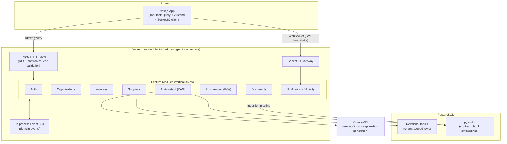
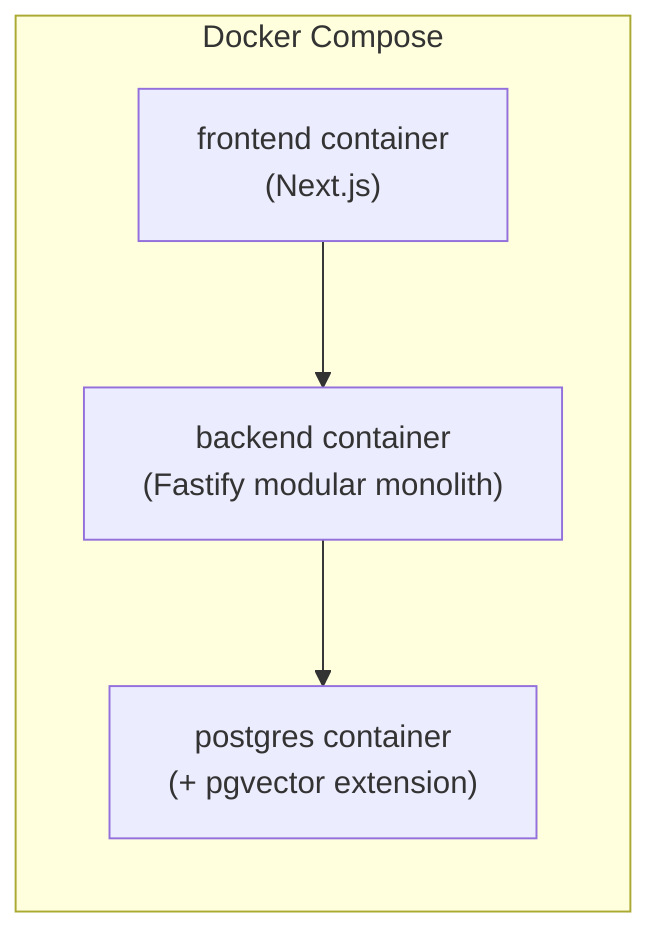
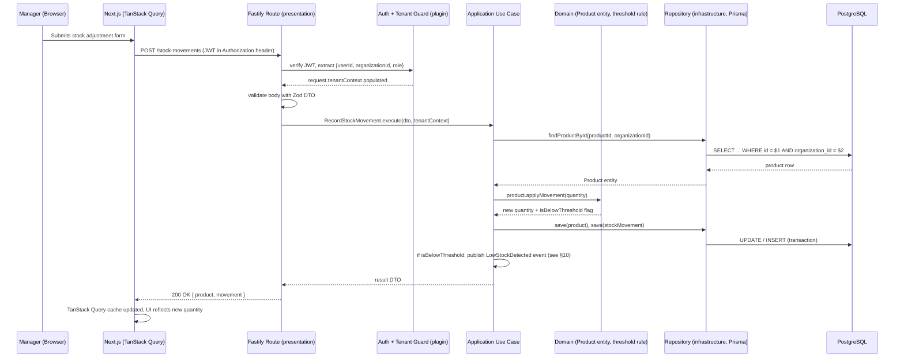
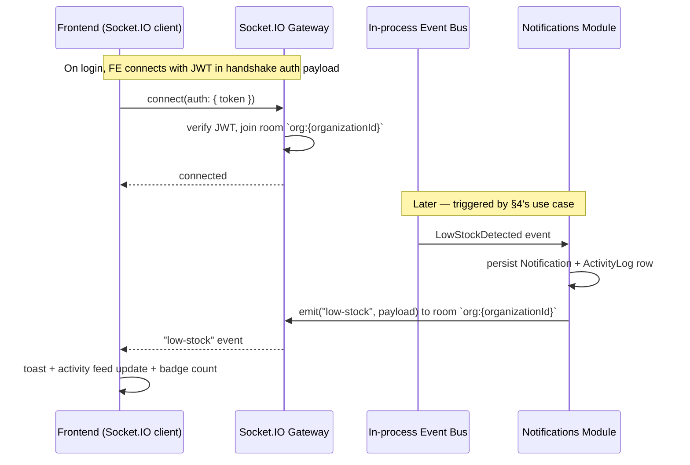
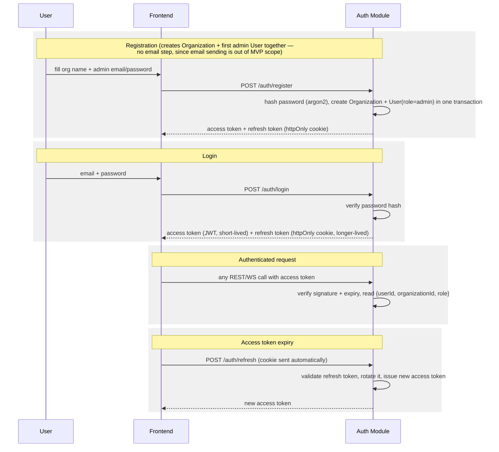
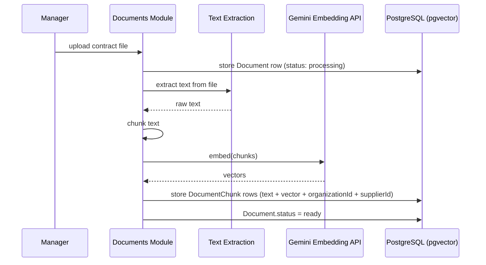
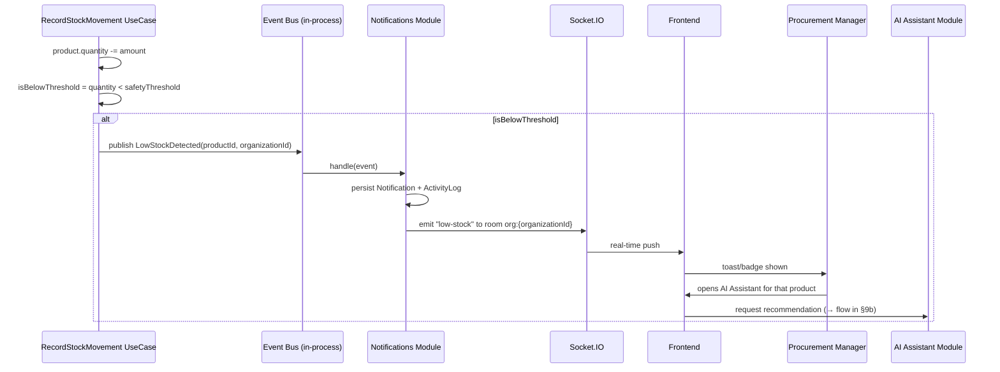

# SupplyFlow — MVP Architecture (Sprint 0)

Status: Design only. No implementation has started.

## 0. Constraints This Design Optimizes For

- Production-style SaaS, but buildable by **one developer** in **~1 month**.
- **Modular monolith**, not microservices.
- **Clean Architecture** (dependency rule: inner layers never depend on outer layers).
- REST for commands/queries, **WebSockets** for real-time push.
- **PostgreSQL** as the single source of truth (relational + vector via `pgvector`).
- Multi-tenant, **one warehouse per organization** in MVP.
- AI **explains**, backend **decides**.
- Every seam below is chosen so that scaling later (more warehouses, more workers, more tenants) is an *additive* change, not a rewrite.

---

## 1. High-Level Architecture Diagram



**Deployment shape (Docker Compose, single VM/host is enough for MVP):**



Everything runs as **one deployable backend service** and **one frontend service**. There is no service mesh, no queue broker, no separate AI microservice — those are explicitly deferred (see §13).

---

## 2. Backend Folder Structure

Clean Architecture applied *per module*, so each module is a self-contained vertical slice with its own four layers. This is what makes "modular monolith" real: a module could be lifted into its own service later without restructuring its internals.

```
backend/
├── src/
│   ├── modules/
│   │   ├── auth/
│   │   │   ├── domain/            # entities, value objects, repository interfaces (ports)
│   │   │   ├── application/       # use cases (Login, RefreshToken, HashPassword policy)
│   │   │   ├── infrastructure/    # Prisma repo impls, bcrypt/argon2 adapter, JWT signer
│   │   │   └── presentation/      # Fastify routes, Zod DTOs, controllers
│   │   ├── organizations/         # Organization + membership/roles
│   │   ├── inventory/             # Product, StockMovement, low-stock threshold logic
│   │   ├── suppliers/             # Supplier, SupplierProduct (structured contract terms)
│   │   ├── documents/             # upload, text extraction, chunking, embedding pipeline
│   │   ├── procurement/           # PurchaseOrder draft/approve lifecycle
│   │   ├── ai-assistant/          # RAG retrieval + explanation orchestration (calls Gemini)
│   │   └── notifications/         # Notification + ActivityLog persistence, WS broadcast
│   │
│   ├── shared/
│   │   ├── domain/                # base Entity/ValueObject, domain error types
│   │   ├── event-bus/             # EventBus port + in-process implementation
│   │   ├── tenant-context/        # AsyncLocalStorage carrying { userId, organizationId, role }
│   │   ├── prisma/                # single PrismaClient instance
│   │   ├── logger/                # Pino instance
│   │   └── config/                # env parsing/validation (Zod)
│   │
│   ├── plugins/                   # Fastify plugins: auth guard, tenant guard, error handler,
│   │                               # request logging, socket.io bootstrap
│   ├── app.ts                     # builds the Fastify instance, registers plugins + modules
│   └── server.ts                  # entrypoint (listen)
│
├── prisma/
│   ├── schema.prisma
│   └── migrations/
├── tests/
│   ├── unit/                      # domain + application layer (no DB, no network)
│   └── integration/                # repository + route tests against a real test DB
└── package.json
```

**Rule enforced across the codebase:** `domain/` never imports from `infrastructure/` or a framework package. `application/` depends only on `domain/` interfaces, never on Prisma or Fastify types directly. This is the one Clean Architecture rule worth being strict about for a solo dev — it's what keeps the "swap Postgres/swap Gemini/extract a service later" promise real instead of aspirational.

---

## 3. Frontend Folder Structure

Next.js App Router, organized by route group first (what a user is doing), then by shared concern.

```
frontend/
├── app/
│   ├── (auth)/
│   │   ├── login/
│   │   └── register/              # creates Organization + first admin User
│   ├── (dashboard)/
│   │   ├── layout.tsx             # authenticated shell, sidebar, socket connection lifecycle
│   │   ├── page.tsx                # Dashboard (KPIs, low-stock summary)
│   │   ├── inventory/
│   │   ├── suppliers/
│   │   ├── documents/
│   │   ├── purchase-orders/
│   │   └── activity/               # activity feed
│   └── layout.tsx                  # root layout, providers
│
├── components/
│   ├── ui/                         # shadcn primitives, unmodified
│   └── features/                   # feature-composed components (e.g. LowStockBanner,
│                                    # SupplierRecommendationPanel, PODraftCard)
│
├── lib/
│   ├── api/                        # typed REST client functions, one file per module
│   ├── socket/                     # Socket.IO client singleton + event type map
│   ├── auth/                       # token storage/refresh helpers
│   └── utils/
│
├── hooks/                          # TanStack Query hooks (useProducts, useSuppliers, ...)
├── store/                          # Zustand stores (UI state: modals, filters, socket status)
├── types/                          # DTO/response types shared with backend contracts
└── middleware.ts                   # route protection (redirect unauthenticated users)
```

Feature folders on the frontend mirror backend modules 1:1 (`inventory` ↔ `inventory`, `suppliers` ↔ `suppliers`, etc.) so that finding "everything about X" never requires guessing.

---

## 4. Request Flow — REST Endpoint

Example: **`POST /api/v1/products/:productId/stock-movements`** (manager records a stock adjustment — the event that kicks off the whole business workflow).



Every write is wrapped in a single Prisma transaction at the repository/use-case boundary — no distributed transaction concerns because everything lives in one database.

---

## 5. Request Flow — WebSocket Event

Example: **low-stock notification pushed to everyone in the organization.**



Rooms are the tenant boundary for WebSockets, mirroring the `organizationId` row-scoping used on REST/DB reads — a socket can only ever be joined to its own organization's room, so there's no path for cross-tenant broadcast leakage.

---

## 6. Authentication Flow



Additional users within an organization are created by an **org admin**, directly through an authenticated "create user" endpoint (not an email invite loop) — consistent with "no email sending" being explicitly out of scope. `role` starts as a small fixed set (`admin`, `manager`) sufficient for MVP; a full permissions system is a future-expansion seam, not an MVP requirement.

---

## 7. Multi-Tenancy Strategy

**Approach: shared database, shared schema, row-level isolation by `organizationId`.**

- Every tenant-owned table (`Product`, `Supplier`, `Document`, `PurchaseOrder`, `Notification`, `ActivityLog`, …) carries a non-nullable `organizationId` column.
- On login/refresh, `organizationId` is embedded in the JWT. A Fastify plugin decodes it once per request and stores it in an `AsyncLocalStorage`-backed **tenant context**, so it doesn't need to be threaded manually through every function call.
- **Enforcement point:** the repository layer. Every repository method that reads or writes tenant data requires `organizationId` as an explicit parameter (sourced from the tenant context, never from client-supplied input). This is a convention enforced by code review + integration tests (a test suite asserts that cross-tenant reads return nothing), not by the database engine — realistic for a one-developer MVP timeline.
- Every tenant-scoped table has a composite index starting with `organizationId` (e.g. `(organizationId, sku)`, `(organizationId, createdAt)`) so tenant isolation and query performance improve together, not at odds.

This is a deliberate MVP-vs-hardening tradeoff, spelled out in §12.

---

## 8. Database Interaction Flow

Single PostgreSQL database, accessed exclusively through **Prisma**, wrapped by the repository pattern so the domain/application layers never see Prisma types.

```
UseCase (application)
   → Repository interface (domain — a "port")
      → Prisma-backed Repository (infrastructure — an "adapter")
         → PrismaClient (shared singleton)
            → PostgreSQL
```

**Core entities (conceptual, not final schema):**

| Entity | Purpose | Key relationship |
|---|---|---|
| Organization | Tenant boundary | has many Users, Products, Suppliers, Documents, PurchaseOrders |
| User | Login identity, role | belongs to one Organization |
| Product | Inventory item, quantity, safety threshold | belongs to Organization |
| StockMovement | Audit trail of quantity changes | belongs to Product |
| Supplier | A vendor | belongs to Organization |
| SupplierProduct | Structured contract terms per supplier×product: price, lead time, min order qty, reliability score | links Supplier ↔ Product — **this is what the deterministic ranking rule reads** |
| Document | Uploaded supplier contract file | belongs to Supplier |
| DocumentChunk | Chunked contract text + `pgvector` embedding | belongs to Document — **this is what RAG retrieves** |
| PurchaseOrder | Draft/approved order | references Product + Supplier |
| PurchaseOrderItem | Line item | belongs to PurchaseOrder |
| Notification / ActivityLog | Real-time + historical event record | belongs to Organization |

`pgvector` lives in the same database as everything else — a similarity search can be filtered by `organizationId` and `supplierId` in the same query as any other lookup, with no cross-database join or separate access-control layer to keep in sync.

Migrations are managed with Prisma Migrate; the repository interfaces mean the schema could, in principle, move to a different store per-module later without touching use cases — not planned for MVP, just a seam kept open.

---

## 9. AI/RAG Interaction Flow

Two separate flows, matching the AI Philosophy: **the backend decides, the AI explains.**

### 9a. Document ingestion (async, happens on upload — not on the hot path)



### 9b. Supplier recommendation + explanation (on-demand, when manager opens the AI assistant for a low-stock product)

```mermaid
sequenceDiagram
    participant U as Manager
    participant AI as AI Assistant Module
    participant Rules as Deterministic Ranking (domain layer, plain code)
    participant Vec as pgvector similarity search
    participant LLM as Gemini (generation)

    U->>AI: "recommend a supplier" for Product X
    AI->>Rules: rank candidate SupplierProduct rows (price, lead time, min qty, reliability)
    Rules-->>AI: recommendedSupplier (deterministic, no LLM involved)
    AI->>Vec: retrieve top-k contract chunks for recommendedSupplier (scoped by organizationId)
    Vec-->>AI: relevant contract clauses
    AI->>LLM: prompt = {recommendedSupplier facts + retrieved clauses} → "explain why, cite terms"
    LLM-->>AI: natural-language explanation
    AI-->>U: recommendation (from Rules) + explanation (from LLM) shown together
    U->>AI: approve → generate PO draft
    AI->>AI: PO numeric fields (qty, price, supplier) come from Rules output, not the LLM;<br/>LLM may draft the order notes/summary text only
```

The **ranking function is a pure, testable, deterministic piece of domain code** — it can be unit tested with zero AI involvement. The LLM only ever sees data *after* the decision is made, and its output is treated as explanatory text, never as a value written into a structured business field (price, quantities, supplier ID). This is the concrete mechanism behind "AI should not make business decisions."

---

## 10. Event Flow — Stock Becomes Low

This ties together §4, §5, and §9b into the full workflow from the business summary.



The event bus is a small internal interface (`publish`/`subscribe`) with an in-process implementation today. Because modules only depend on the **interface**, not the implementation, swapping it for a real broker (BullMQ/Redis Streams) later — e.g. once ingestion or notifications need to survive a process restart — is a change confined to `shared/event-bus/`, not to any module's business logic.

---

## 11. Key Architectural Decisions & Rationale

| Decision | Why |
|---|---|
| Modular monolith over microservices | One developer, one month. Microservices add network boundaries, deployment complexity, and distributed-transaction problems that buy nothing at this scale — the modular boundaries already exist in code, so services can be extracted later *if* a real scaling reason shows up. |
| Clean Architecture per module | Keeps business rules (esp. the deterministic supplier ranking) testable without spinning up a DB or calling an LLM. Also the actual mechanism that makes "extract a module into a service later" plausible instead of aspirational. |
| Row-level multi-tenancy (shared schema) | Simplest correct model for the data volume of an MVP; one migration path, one connection pool, one backup story. Schema/DB-per-tenant multiplies operational work a solo dev doesn't have time for. |
| In-process event bus (not a queue) | The MVP has no requirement that survives a process crash mid-flight (no payment, no email). A queue is operational overhead — extra container, extra failure mode — with no MVP-stage payoff. The interface is kept generic so this is swappable later. |
| pgvector instead of a dedicated vector DB | One database to run, back up, and secure instead of two. Tenant scoping (`organizationId`) works identically for vector and relational queries because they're the same table family. |
| Deterministic ranking in application/domain code, LLM only for retrieval + explanation | Directly implements the stated AI Philosophy, and makes the core business logic unit-testable and auditable — a procurement manager can be shown *why* a supplier was picked without trusting an LLM's arithmetic. |
| JWT (access + refresh) over server-side sessions | No session store to run (no Redis dependency in MVP). `organizationId` + `role` embedded in the token means tenant/role checks don't require a DB round-trip on every request. |
| Socket.IO rooms keyed by `organizationId` | Reuses the same tenant boundary concept as the DB layer instead of inventing a second one for real-time. |
| Fastify over Express | Built-in schema validation hooks, better TypeScript ergonomics, meaningfully faster — relevant since this one process handles everything. |
| Next.js App Router | Colocates routing with the dashboard's natural information architecture (inventory / suppliers / documents / POs), and Server Components reduce client-side data-fetching boilerplate for read-heavy dashboard views. |

---

## 12. Alternatives Considered & Rejected (for MVP)

| Alternative | Why it was rejected for now |
|---|---|
| Microservices (separate Inventory/Procurement/AI services) | Wrong-sized for one developer and a one-month timeline; introduces service discovery, inter-service auth, and distributed tracing needs that have zero MVP payoff. The modular monolith's module boundaries are the cheap version of this, kept as a future extraction point. |
| Database-per-tenant or schema-per-tenant | Correct for very strict isolation or large-scale SaaS, but multiplies migration/backup/connection-pool operations by tenant count — unmanageable for a solo dev and unnecessary at MVP scale. Row-level isolation is the standard, proven default at this stage. |
| Postgres Row-Level Security (RLS) as the *primary* isolation mechanism | Real defense-in-depth, but adds a second enforcement path (DB session variables) that has to be kept in sync with Prisma's connection pooling — meaningful setup and testing cost. Rejected as the *primary* mechanism for MVP; noted in §13 as a strong fast-follow once the app has real users and the extra hardening is worth the time. |
| Separate vector database (Pinecone/Weaviate/Qdrant) | Extra system to run, secure, and keep consistent with Postgres; `pgvector` at MVP's document/query volume performs fine and keeps tenant scoping unified. Revisit only if embedding volume or query latency actually demands it. |
| LangChain / LangGraph for the AI orchestration | The actual AI workflow here is one retrieval step + one generation call — not a multi-step/looping agent. Those frameworks add an abstraction and debugging layer that isn't earning its cost yet. Direct Gemini SDK calls plus a hand-written retrieval function are simpler to reason about and sufficient for the "explain, don't decide" scope. Worth reconsidering only if the assistant grows genuinely stateful/multi-step behavior. |
| Message queue (BullMQ/Redis Streams) for events | No MVP flow needs at-least-once delivery across process restarts. Adding a broker now is operational cost paid before it's earned. The event-bus interface is kept broker-agnostic specifically so this can be swapped in later without touching module code. |
| Multi-warehouse data model from day one | Explicitly out of MVP scope. Modeling `Product.quantity` as a single field now (rather than a `Warehouse` × `Product` stock table) is faster to build; the future migration is additive (add a `Warehouse` entity, move quantity onto a join table) rather than a rewrite, because inventory logic is already isolated in its own module. |
| Server-rendered sessions / cookie-only auth without JWT claims | Would require a DB lookup (or Redis-backed session store) on every request to know `organizationId`/`role`. JWT claims avoid that dependency entirely for MVP, at the acceptable cost of needing refresh-token rotation. |

---

## 13. Deliberately Deferred (the expansion seams)

Not required for MVP, but each is a bounded, additive change given the boundaries above — listed so it's clear the architecture was chosen with these in mind, not blind to them:

- **Multi-warehouse** → add `Warehouse` entity + move `Product.quantity` onto a `WarehouseStock` join table; Inventory module absorbs the change, nothing outside it needs to know.
- **Postgres RLS** → add as a second, defense-in-depth enforcement layer once repository-layer scoping has proven itself in production.
- **Message queue** → swap the `EventBus` implementation in `shared/event-bus/` from in-process to BullMQ/Redis Streams; module code is untouched.
- **Horizontal scaling of the backend** → once running >1 instance, Socket.IO needs its Redis adapter for cross-instance room broadcast; everything else in the modular monolith is stateless and scales trivially behind a load balancer.
- **Extracting a module into its own service** → because each module's `domain`/`application` layers don't import Prisma or Fastify directly, the highest-traffic module (likely `ai-assistant`, given LLM latency) is the one best positioned to be pulled out first, if it's ever needed.
- **Object storage for documents** → MVP can start with local/disk storage behind the `documents` module's storage port; swapping to S3-compatible storage is an infrastructure-layer change only.
- **Roles/permissions beyond `admin`/`manager`** → the tenant-context + JWT-claims mechanism already carries `role`; adding finer-grained permissions is additive to the auth module.

---

*This document lives at `docs/architecture.md` and should be updated as decisions change — treat it as the standing reference for Sprint 0 onward, not a one-time artifact.*
